# US Accidents Dashboard (2016 - 2023)

This project provides an interactive dashboard for exploring and analyzing a countrywide traffic accident dataset covering 49 U.S. states from 2016 to 2023. With over 1.5 million records, the dataset includes detailed information on accident severity, location, weather conditions, and more. The dashboard offers a wide range of visualization and analysis tools to understand patterns, trends, and hotspots in U.S. traffic accidents.

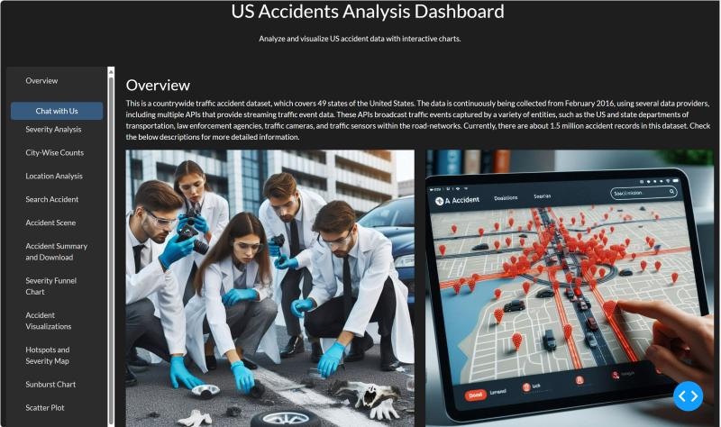

## Dataset

This project uses a sampled subset of the "US-Accidents: A Countrywide Traffic Accident Dataset" by Sobhan Moosavi et al. The full dataset is **not included in this repository** due to its size. To run the dashboard locally:

1. Download the dataset from [Kaggle — US Accidents (2016-2023)](https://www.kaggle.com/datasets/sobhanmoosavi/us-accidents).
2. Place the CSV file in the project root as `US_Accidents_March23_sampled_500k.csv` (or update the file path referenced in `trial.py` to match your local copy).

## Project Features

### Overview
An introduction to the dashboard features.

### Chat with Us
A chatbot powered by the Phi language model that answers basic questions about the dataset.

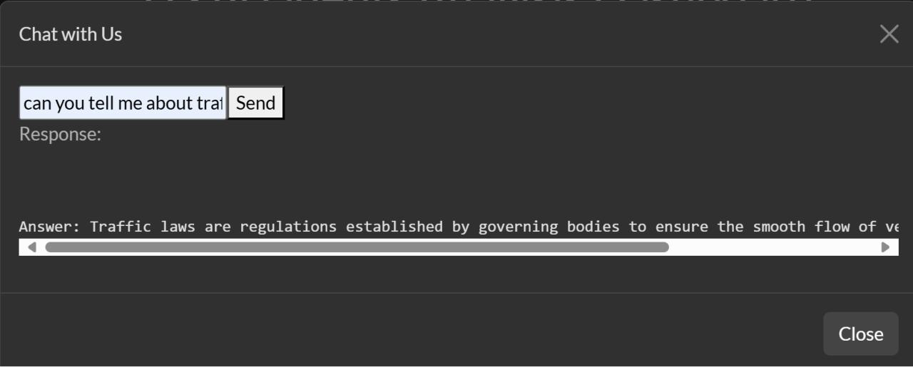
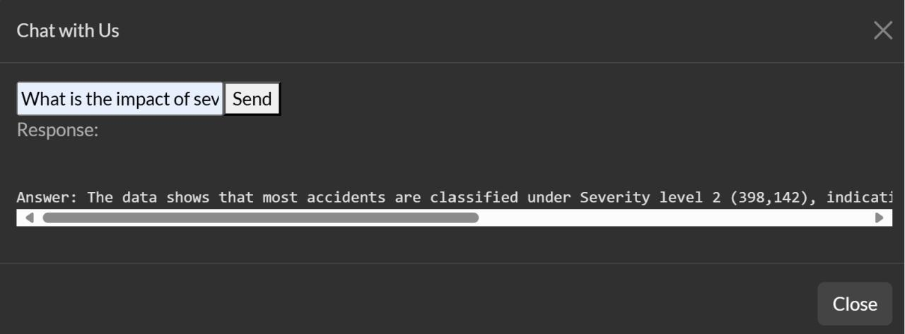

### Severity Analysis
Interactive gauge displaying street names based on accident severity (ranging from 1 to 4).

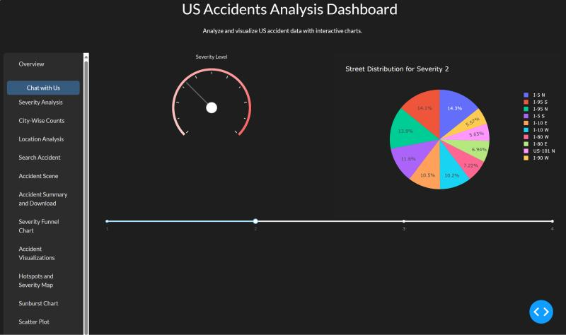

### City-wise Counts
Bar charts showing accident severity counts for different cities.

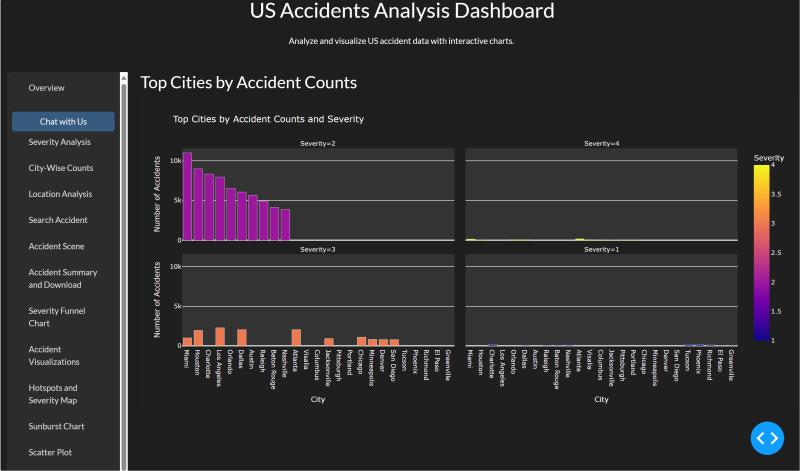

### Location Analysis
A map visualizing accident distribution based on severity, using a gradient from dark blue to yellow.

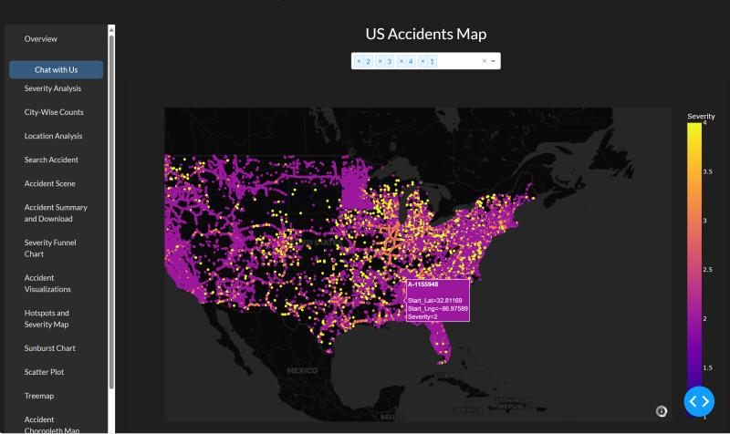

### Search Accident
A search tool with gauge charts that display accident-specific metrics such as wind speed, humidity, precipitation, and wind direction.

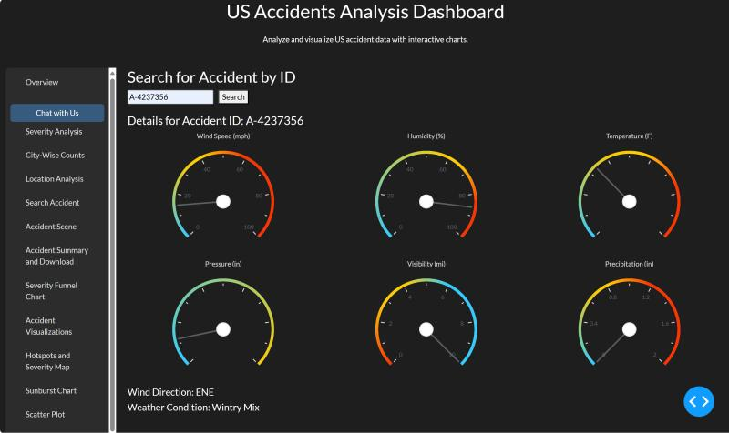

### Accident Scene Creation
A map visualization showing the routes affected by a selected accident.

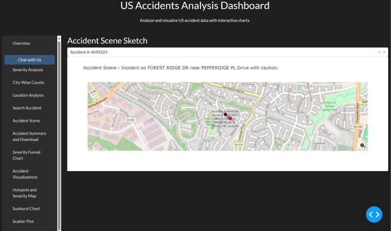

### Accident Summary & Download
Generates and allows downloading of summary reports for selected accidents.

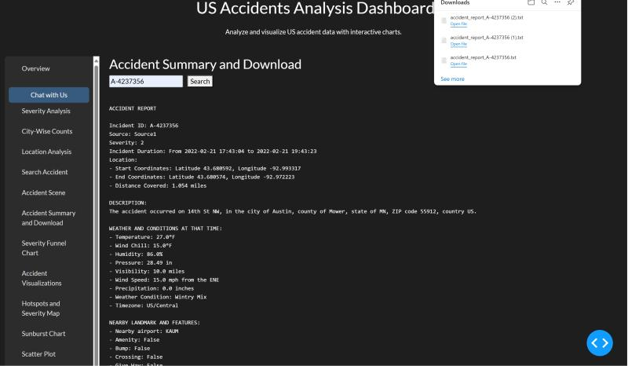

### Severity Funnel Chart
Visualizes accident counts and severity levels.

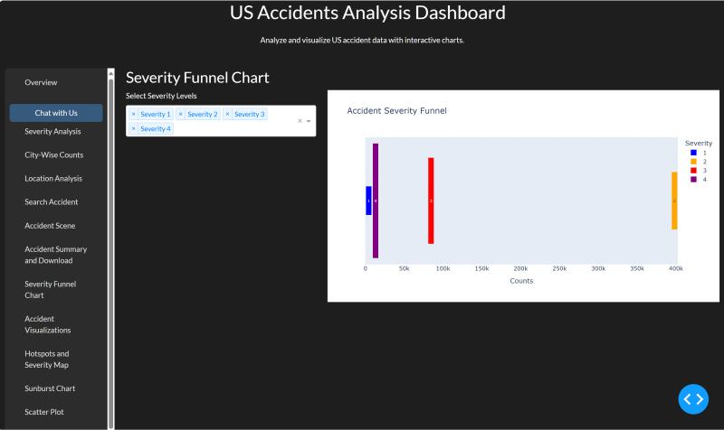

### Accident Visualization
Includes advanced visualizations like violin plots and parallel coordinates plots.

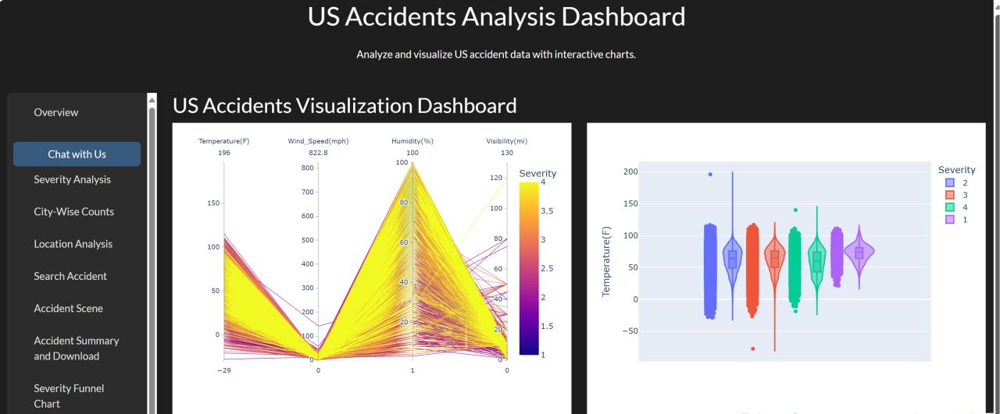

### Hotspots & Severity Map
Identifies accident hotspots and visualizes severity levels on a map.

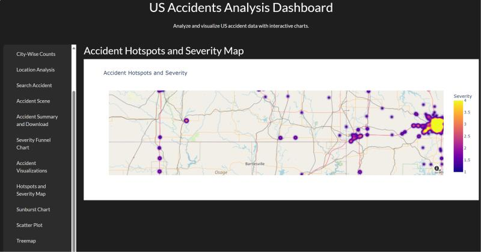

### Sunburst Chart
Provides hierarchical visualization of accident data.

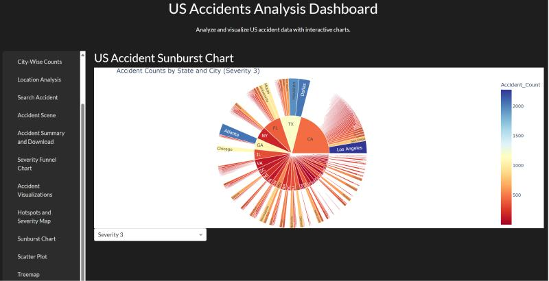

### Accident Choropleth Map
A color-coded map representing accident severity across different regions.

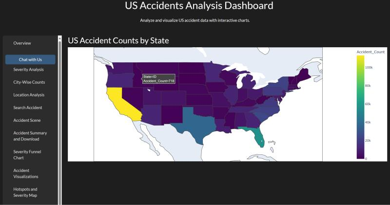

### Top Cities by Severity
Lists cities with the most severe accidents.

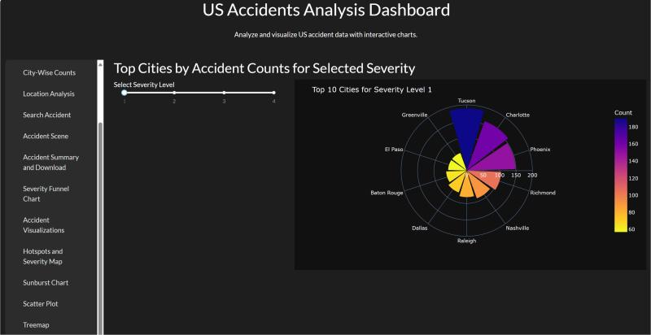

### Correlation Matrix
Displays correlations between different accident attributes.

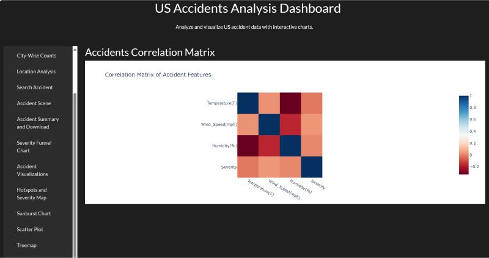

### Bubble Chart
Visualizes the relationship between various accident metrics.

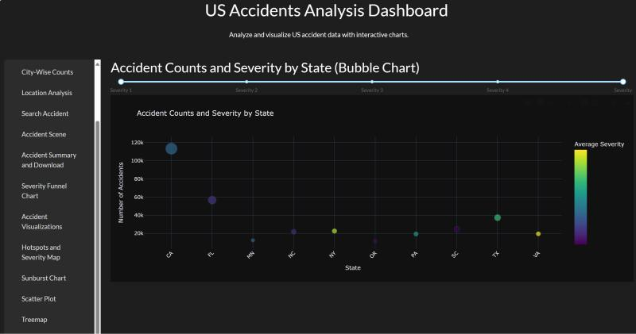

### Scatter Plot & Treemap
Additional views for severity-vs-distance analysis and severity/weather-condition breakdowns.

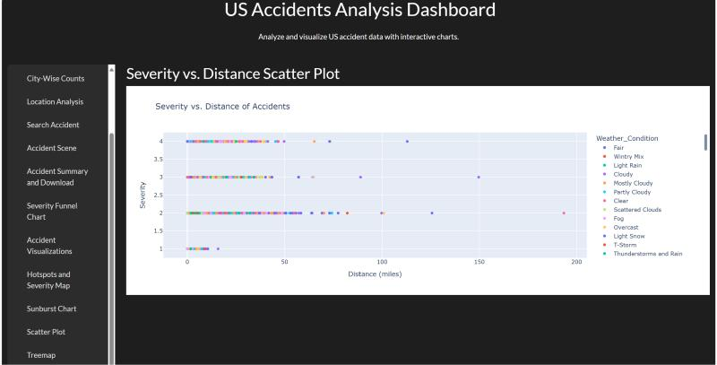
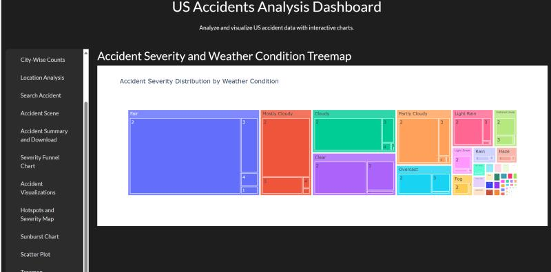

## Acknowledgment

The dataset used in this project is based on the "US-Accidents: A Countrywide Traffic Accident Dataset" by Sobhan Moosavi et al., which has been widely used for academic research.
